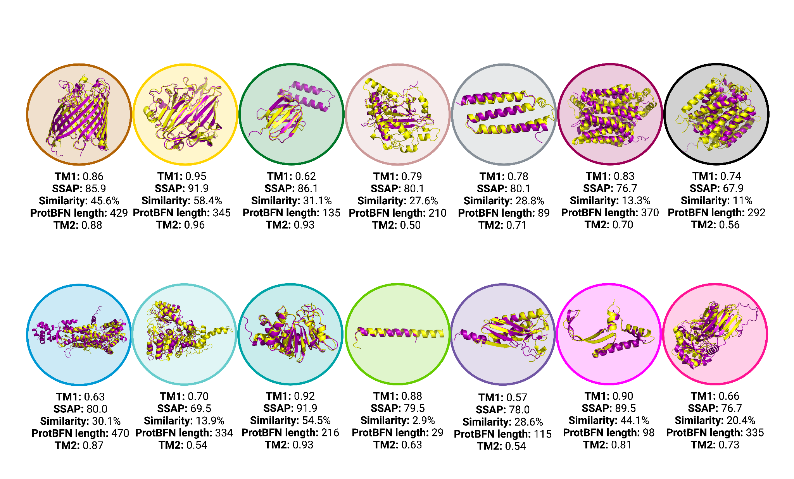
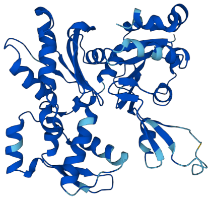

[](https://creativecommons.org/licenses/by-nc-sa/4.0/)


# Protein Sequence Modelling with Bayesian Flow Networks

Welcome to the inference code for the paper ["Protein Sequence Modelling with Bayesian Flow Networks"](https://www.biorxiv.org/content/10.1101/2024.09.24.614734v1). With this code, you can sample from our trained models ProtBFN, for general proteins, and AbBFN, for antibody VH chains. 

## :wave: Overview

[Bayesian Flow Networks](https://arxiv.org/abs/2308.07037) are a new approach to generative modelling, and can be viewed as an extension of diffusion models to the parameter space of probability distributions. They define a continuous-time process that maps between a naive prior distribution and a psuedo-deterministic posterior distribution for each variable independently. By training our neural network to 'denoise' the current posterior, by taking into account mutual information between variables, we implicitly minimise a variational lower bound. We can then use our trained neural network to generate samples from the learned distribution.

One of the benefits of defining such a process in probability parameter space is that it can be applied to *any* family of distributions with continous-valued parameters. This means that BFNs can be directly applied to discrete data, allowing for diffusion-like generative modelling for sequences without restrictive left-to-right inductive biases or relying on discrete-time stochastic processes. The main focus of our work is to investigate the application of BFNs to *protein sequences*, as represented by a sequence of amino acids. The ProtBFN methodology is broadly summarised below:


Having trained ProtBFN, we find that it is exceptionally performant at unconditional generation of de novo protein sequences. For example, we find that we are able to rediscover a variety of structural motifs, according to structures predicted by ESMFold, with high sequence novelty:



## :rocket: Getting Started

To get started, you need to modify `Makefile` to use your accelerator. For example, if you are using a GPU, you would modify the `Makefile`:

```
ACCELERATOR = GPU
```

You can choose between CPU, TPU and GPU accelerators. Please note that multi-host inference is not supported by this code release, and you should therefore restrict your hardware usage to single-host settings. Once you have configured your accelerator, simply run

```text
> make build
```

to build the `protbfn` docker image. We typically find that this step takes 5-20 minutes to run, depending on your hardware. 

## :atom: Sample De-novo Proteins with ProtBFN and AbBFN

Sampling is performed with the `sample.py` script. We've included a shortcut command in `Makefile` that let's you run `sample.py` through the docker image that you have just built, with run arguments appropriate for your chosen accelerator. To run sampling, simply call:

```text
> make sample
```

Your samples will be written to `samples/samples.fasta` by default. This file will contain a variety of de-novo generated protein sequences:

```text
>sample_0 loss: 34.71, perplexity: 1.10
MCDDEETTALVCDNGSGLCKAGFAGDDAPRAVFPSIVGRPRHQGVMVGMGQKDSYVGDEA
QSKRGILTLKYPIEHGIITNWDDMEKIWHHTFYNELRVAPEEHPTLLTEAPLNPKANREK
MTQIMFETFNVPAMYVAIQAVLSLYASGRTTGIVLDSGDGVTHNVPIYEGYALPHAIMRL
DLAGRDLTDYLMKILTERGYSFVTTAEREIVRDIKEKLCYVALDFENEMATAASSSSLEK
SYELPDGQVITIGNERFRCPETLFQPSFIGMESAGIHETAYNSIMKCDIDIRKDLYANNV
LSGGTTMYPGIADRMQKEITALAPSTMKIKIIAPPERKYSVWIGGSILASLSTFQQMWIS
KQEYDEAGPSIVHRKCF
>sample_1 loss: 875.64, perplexity: 7.22
MTAPGGRPERDRAWGAVVCATVIAYAGNWLVYVGISFLAVEDGGSAVQTGGFATAAALGY
LLVGLVVGPVVDKVGLRRTLVAADVLKAASMLSLWLLLGPERSGGTAAQVVLGFVVLVVV
TALLDAVRDIGVTTLVAGLTPEGRLGRAGAVTSAGGSVGVFAGGSAAGAVFEALGTRGGF
LLTSLLSAAAALLALLAARRGATSEAVPPRPVGERASWRHDVAAGVRRLLSHRLLRAVGV
AVTVTMVADTLLTVTLPVYLTDHLGLSDADLGTMIGLLGVTGLAGSAGSGVLADRAGRRR
TLVGSALVFAVPLVATGLLADPVDRPAVVIVLAWFVTGLGGTFYHVVLTSWRQDVTPLDV
VARVASAWRVLTLAARPVGALAGGWLVDHLGLVPVMVLLGLAGVGTAALWRGRGAGAAAP
GAGPAPDGATAAAPTDPTTLADG
...
```

You can render individual generated proteins using tools such as the [ESMFold web API](https://esmatlas.com/resources?action=fold). For example, we can see that the first protein generated above is a high confidence complex structure:



There are a variety of commandline arguments that you can use to modify the sampling behaviour. These are passed through the `RUN_ARGS` argument. For example:

```text
# Sample the ProtBFN model
> make sample RUN_ARGS="--model ProtBFN"  
# Sample the AbBFN model
> make sample RUN_ARGS="--model AbBFN"
# Sample 8 sequences per batch across 10 batches e.g. 80 sequences total
> make sample RUN_ARGS="--model ProtBFN --num_samples_per_batch=8 --num_batches=10"
# Apply the perplexity and repetitivity filtering to samples as used in the paper
> make sample RUN_ARGS="--model ProtBFN --filter_samples"
```

For a complete usage, simply run:

```text
> make sample RUN_ARGS="--help"

usage: sample.py [-h] [--model MODEL] [--num_steps NUM_STEPS] [--seed SEED]
                 [--force_reload]
                 [--num_samples_per_batch NUM_SAMPLES_PER_BATCH]
                 [--num_batches NUM_BATCHES] [--filter_samples]
                 [--perplexity_threshold PERPLEXITY_THRESHOLD]
                 [--repetivity_threshold REPETIVITY_THRESHOLD]
                 [--output_dir OUTPUT_DIR]

Sample from a BFN

optional arguments:
  -h, --help            show this help message and exit
  --model MODEL         Name of the model; this can be either ProtBFN or AbBFN
  --num_steps NUM_STEPS
                        Number of sampling steps
  --seed SEED           Random seed
  --force_reload        Force reload the model parameters
  --num_samples_per_batch NUM_SAMPLES_PER_BATCH
                        Number of samples to generate per batch
  --num_batches NUM_BATCHES
                        Number of batches to generate
  --filter_samples      Filter samples by perplexity and repetivity
  --perplexity_threshold PERPLEXITY_THRESHOLD
                        perplexity threshold for filtering
  --repetivity_threshold REPETIVITY_THRESHOLD
                        Repetivity threshold for filtering
  --output_dir OUTPUT_DIR
                        Output directory for samples

```

In particular, if your model parameters ever get corrupted, for example through an interrupted download, you can forcibly reset them through the `--force_reload` parameters:

```text
# Run sampling with the AbBFN model and forcibly reload the model parameters
make sample RUN_ARGS="--model AbBFN --force_reload"
```


## :art: Inpaint Antibody VH chains

Inpainting is performed with the `inpaint.py` script. As with sampling, we've included a shortcut command in `Makefile` that let's you run `sample.py` through the docker image that you have just built, with run arguments appropriate for your chosen accelerator. To run inpainting, simply call:

```text
> make inpaint
```

This command will take the sequences in `example_inputs/sequences.fasta` and, by default, perform inpainting on the `CDR3` region.  Your samples will be written to `samples/inpainted_samples.fasta` by default:

```text                                                                                   
>1i9r-K-inpainted inpainted with AAR 0.27272725105285645
QVQLVQSGAEVVKPGASVKLSCKASGYIFTSYYMYWVKQAPGQGLEWIGEINPSNGDTNF
NEKFKSKATLTVDKSASTAYMELSSLRSEDTAVYYCTRRGRYYALDYWGQGTLVTVSS
>6bb4-I-inpainted inpainted with AAR 0.75
QVQLQQSDAELVKPGASVKISCKASGYTFTDRTIHWVKQRPEQGLEWIGYIYPGDDSTKY
NDMFKAKATLTADKSSNTAYMQLNSLTSDDSAVYFCAREGAMDYWGQGTSVTVSS
>7k8u-H-inpainted inpainted with AAR 0.0
QVQLQQWGAGLLKPSETLSLSCAVYGGSLSGYYWSWIRQPPGKGLEWIGEINHFGSTGYN
PSLKSRVTISVDTSKSQFSVKLSSVTAADTAVYYCDIWGQGTMVTV
...
```


You can see inpainting behaviour in detail by passing the `--verbose` parameter:

```text 
> make inpaint RUN_ARGS="--verbose"

Model weights for AbBFN already downloaded and stored in parameters/AbBFN
Sampling across 1 hosts.
Found 4 local devices.
Sampling 1 samples per device per batch of 4.
Number of samples to inpaint is 20
Padding input to length 20 for batching
Begin sampling
100%|██████████| 5/5 [29:18<00:00, 351.65s/it]
Sampling completed
Number of inpainted samples:  20
Writing samples to disk: samples/inpainted_samples.fasta
QVQLVQSGAEVVKPGASVKLSCKASGYIFTSYYMYWVKQAPGQGLEWIGEINPSNGDTNFNEKFKSKATLTVDKSASTAYMELSSLRSEDTAVYYCTRSDGRNDMDSWGQGTLVTVSSA
                                                                                                XXXXXXXXXXX           

Inpainted to:

QVQLVQSGAEVVKPGASVKLSCKASGYIFTSYYMYWVKQAPGQGLEWIGEINPSNGDTNFNEKFKSKATLTVDKSASTAYMELSSLRSEDTAVYYCTRRGRYYALDYWGQGTLVTVSS
                                                                                                ||-------|-           

AAR: 0.27272725105285645

QVQLQQSDAELVKPGASVKISCKASGYTFTDRTIHWVKQRPEQGLEWIGYIYPGDDSTKYNDMFKAKATLTADKSSNTAYMQLNSLTSDDSAVYFCARRGTMDYWGQGTSVTVSSA
                                                                                                XXXXXXXX           

Inpainted to:

QVQLQQSDAELVKPGASVKISCKASGYTFTDRTIHWVKQRPEQGLEWIGYIYPGDDSTKYNDMFKAKATLTADKSSNTAYMQLNSLTSDDSAVYFCAREGAMDYWGQGTSVTVSS
                                                                                                ||-|-|||           

AAR: 0.75

...

Average AAR: 0.30792853236198425
```

Where `AAR` refers to the Amino Acid Recovery rate, a key statistic reported in our paper. An `X` is used to indicate that a given amino acid is masked (and inpainted), and a `|` symbol indicates that it was correctly recovered, whereas a `-` symbol indicates that a different amino acid was generated. 

Note that in the paper, we used a substantially more expensive regime, with 1024 particles:

```text
make inpaint RUN_ARGS="--num_particles 1024"
```

For a complete usage, simply run:

```text
> make inpaint RUN_ARGS="--help"
usage: inpaint.py [-h] [--model MODEL] [--force_reload] [--seed SEED]
                  [--num_steps NUM_STEPS] [--num_particles NUM_PARTICLES]
                  [--num_samples_per_batch NUM_SAMPLES_PER_BATCH]
                  [--input_file INPUT_FILE] [--numbering_file NUMBERING_FILE]
                  [--region REGION] [--output_dir OUTPUT_DIR] [--verbose]

Inpaint with a BFN

optional arguments:
  -h, --help            show this help message and exit
  --model MODEL         Name of the model; this can be either ProtBFN or AbBFN
  --force_reload        Force reload the model parameters
  --seed SEED           Random seed
  --num_steps NUM_STEPS
                        Number of sampling steps
  --num_particles NUM_PARTICLES
                        Number of particles
  --num_samples_per_batch NUM_SAMPLES_PER_BATCH
                        Number of samples to inpaint per batch
  --input_file INPUT_FILE
                        Path to the input file
  --numbering_file NUMBERING_FILE
                        Path to the ANARCI numbering file
  --region REGION       Region to inpaint
  --output_dir OUTPUT_DIR
                        Output directory for samples
  --verbose             Whether to print every inpainted sample
```

If you want to work with your own data, you will need to create a `numbering.npy` file. This file contains a `(N, 7, max_len)` ndarray, where `N` is the number of sequences in the fasta file (ordered also by their appearance in the fasta). Each of the 7 dims in the second axis correspond to a region. In order, these are:

```
CDR1, CDR2, CDR3, FR1, FR2, FR3, FR4
```

The last axis refers to the position in the chain, padded to the length of the longest sequence in the fasta file, with `1` denoting that a residue belongs to the region of interest. That is, `numbering[13, 1, :]` will yield a vector where all positions corresponding to cdr2 for the 14th sequence are `1`.

## 🤝 Cite our work

If you have used ProtBFN or AbBFN in your work, you can cite us using the following bibtex entry:

```text
@article {Atkinson2024.09.24.614734,
	author = {Atkinson, Timothy and Barrett, Thomas D. and Cameron, Scott and Guloglu, Bora and Greenig, Matthew and Robinson, Louis and Graves, Alex and Copoiu, Liviu and Laterre, Alexandre},
	title = {Protein Sequence Modelling with Bayesian Flow Networks},
	elocation-id = {2024.09.24.614734},
	year = {2024},
	doi = {10.1101/2024.09.24.614734},
	publisher = {Cold Spring Harbor Laboratory},
	URL = {https://www.biorxiv.org/content/early/2024/09/26/2024.09.24.614734},
	eprint = {https://www.biorxiv.org/content/early/2024/09/26/2024.09.24.614734.full.pdf},
	journal = {bioRxiv}
}
```
